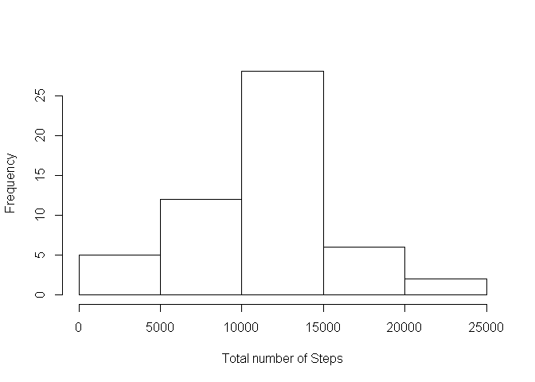
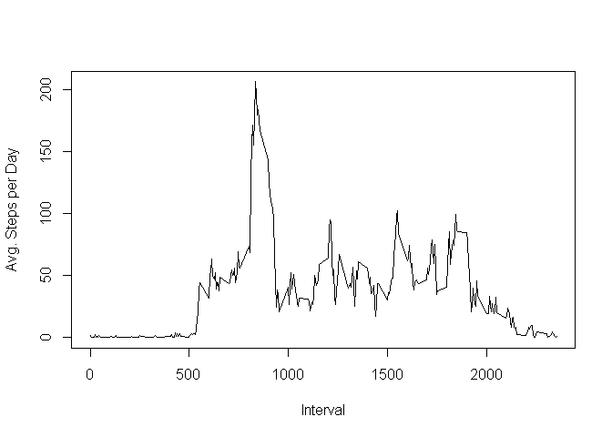
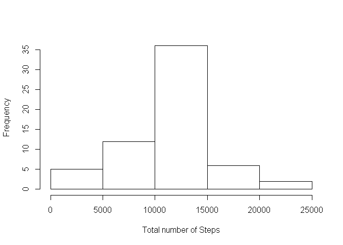
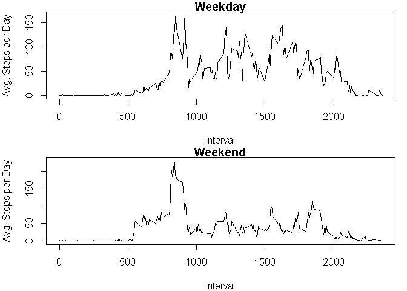

# Reproducible Research: Peer Assessment 1

###Loading activity data.


```r
data <- read.csv("activity.csv");
```


###Total number of steps taken per day
Part 1: Histogram of the total number of steps taken each day:


```r
stepsPerDay <- tapply(data$steps, data$date, sum);
hist(stepsPerDay, main = "", xlab = "Total number of Steps");
```

 

Part 2:

Mean of steps per day:


```r
mean(stepsPerDay, na.rm = T);
```

```
## [1] 10766.19
```

Median of steps per day:


```r
median(stepsPerDay, na.rm = T);
```

```
## [1] 10765
```

###Average daily activity pattern


```r
stepsPerInterval <- aggregate(data$steps ~ data$interval, FUN = mean);
```

Part 1:  Time series plot

```r
plot(stepsPerInterval[,1], stepsPerInterval[,2], type = "l", xlab = "Interval", ylab = "Avg. Steps per Day", main = "");
```

 

Part 2: 5-minute interval having the maximum number of steps


```r
stepsPerInterval[stepsPerInterval[,2]==max(stepsPerInterval[,2]),][1,1];
```

```
## [1] 835
```

###Imputing missing values

Part 1: The total number of missing values


```r
nrow(data[is.na(data$steps),]);
```

```
## [1] 2304
```

Part 2: Strategy for filling in all of the missing values in the dataset:
Mean for that 5-minute interval is used to fill in missing values.


Part 3: Filling in all of the missing values in the dataset:

```r
dataNoNA <- read.csv("activity.csv");
dataLength <- nrow(dataNoNA);
for(i in 1:dataLength)
  {
    if(is.na(dataNoNA[i,1]))
      {
        dataNoNA[i,1] <- as.integer(stepsPerInterval[stepsPerInterval[,1]==dataNoNA[i,3],][1,2]);
      }
  }
```

Part 4:

Histogram:

```r
stepsPerDayNoNA <- tapply(dataNoNA$steps, dataNoNA$date, sum);
hist(stepsPerDayNoNA, main = "", xlab = "Total number of Steps");
```

 

Mean of steps per day:

```r
mean(stepsPerDayNoNA);
```

```
## [1] 10749.77
```

Median of steps per day:

```r
median(stepsPerDayNoNA);
```

```
## [1] 10641
```

Do these values differ from the estimates from the first part of the assignment?
Ans: ???.

What is the impact of imputing missing data on the estimates of the total daily number of steps?
Ans: ?????

###Activity patterns between weekdays and weekends

Part 1: Factor variable in the dataset with two levels - "weekday" and "weekend".

```r
dateWeekday <- weekdays(as.Date(dataNoNA[,2], format = "%Y-%m-%d"));
weekdayFactor <- sapply(dateWeekday, function(x){if(x == "Sunday" | x == "Saturday"){y <- "Weekend"}else{y <- "Weekday"};y});
weekdayFactor <- factor(weekdayFactor, labels = c("Weekend", "Weekday"));
```


Part 2: Panel plot containing a time series plot.

```r
dataWeekday <- dataNoNA[weekdayFactor=="Weekday",];
dataWeekend <- dataNoNA[weekdayFactor=="Weekend",];

WeekdayStepsPerInterval <- aggregate(dataWeekday$steps ~ dataWeekday$interval, FUN = mean);
WeekendStepsPerInterval <- aggregate(dataWeekend$steps ~ dataWeekend$interval, FUN = mean);

par(mfrow=c(2,1), mar= c(4,4,1,1))
plot(WeekdayStepsPerInterval[,1],WeekdayStepsPerInterval[,2], type="l", xlab = "Interval", ylab = "Avg. Steps per Day", main = "Weekday")
plot(WeekendStepsPerInterval[,1],WeekendStepsPerInterval[,2], type="l", xlab = "Interval", ylab = "Avg. Steps per Day", main = "Weekend")
```

 
